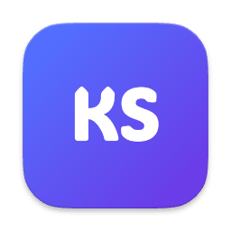
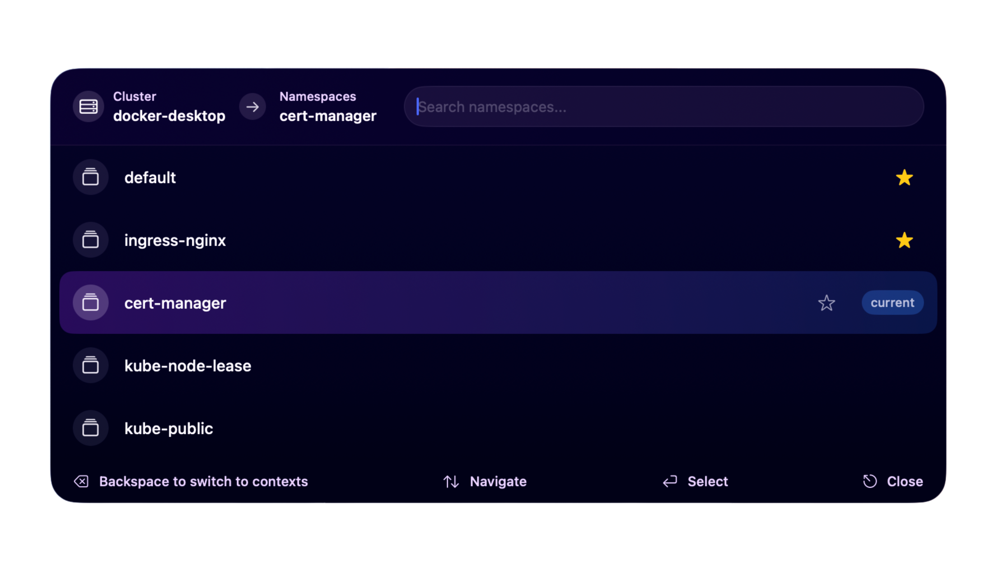

<div align="center">
  
  
  # KubeSwitch
  
  **Fast Kubernetes Context Switcher for macOS**
  
  [](https://www.apple.com/macos/)
  
  Switch between Kubernetes contexts and namespaces instantly with KubeSwitch. Native macOS menu bar app with QuickSwitch (⌘⇧L). Supports EKS, GKE, AKS, and any K8s cluster.
  
  <a href="https://builds.kubeswitch.com/latest/kubeswitch.dmg">
    
  </a>
  
  
</div>

## ✨ Features

- 🔄 **Quick Context Switching** - Switch between Kubernetes contexts and namespaces directly from the menu bar
- ⌨️ **Global Keyboard Shortcut** - Press ⌘⇧L to open the QuickSwitch panel
- 🔍 **Smart Search** - Search through contexts and namespaces with fuzzy matching
- ⭐ **Favorites System** - Mark frequently used contexts and namespaces as favorites
- 📱 **Spotlight-style Interface** - Fast, native macOS interface for quick switching
- 🔄 **Automatic Sync** - Detects kubeconfig changes through intelligent file monitoring
- 🖥️ **Universal Binary** - Native support for both Intel and Apple Silicon Macs
- 📊 **Performance Monitoring** - Built-in performance tracking and diagnostics
- 📝 **Advanced Logging** - Configurable logging with rotation and multiple levels

## 🚀 Quick Start

### Installation

1. **Download the latest release**:
   ```bash
   curl -L https://builds.kubeswitch.com/latest/kubeswitch.dmg -o kubeswitch.dmg
   ```

2. **Open the DMG file and drag KubeSwitch.app to your Applications folder**

3. **Launch the application**

4. **Configure your kubeconfig path(s) in the settings**

### First Launch

On first launch, KubeSwitch will open the settings window where you can configure:

- **kubectl Path** - Path to your kubectl binary (auto-detected for Homebrew)
- **Kubeconfig Paths** - One or more paths to kubeconfig files
- **Launch at Startup** - Automatically start KubeSwitch when you log in
- **Keyboard Shortcut** - Customize the QuickSwitch hotkey

## 🎯 Usage

### Menu Bar

Click the Kubernetes icon in your menu bar to:

- View current context and namespace
- Switch between contexts and namespaces
- Mark items as favorites (right-click)
- Access settings and diagnostics

### QuickSwitch Panel

1. Press **⌘⇧L** (or your custom shortcut) to open QuickSwitch
2. Start typing to search for a context
3. Press **Enter** to select and switch to namespace selection
4. Type to search for a namespace
5. Press **Enter** to apply the selection
6. Press **ESC** to cancel at any time

### Favorites

Mark frequently used contexts and namespaces as favorites:

- Click the star icon in QuickSwitch
- Right-click items in the menu bar
- Use "Manage Favorites" to clear all favorites

## 🛠️ System Requirements

- macOS 15.0 or later
- kubectl binary (auto-detected for Homebrew installations)
- At least one valid kubeconfig file

## 🔧 Diagnostics

KubeSwitch includes comprehensive diagnostic tools:

- **View Logs** - Built-in log viewer (Diagnostics → View Logs)
- **Export Diagnostics** - Create a diagnostic package for troubleshooting
- **Force Refresh** - Manually refresh the cache if needed

## 📝 Support

- **Report a Bug**: [Here](https://github.com/KubeSwitch/kubeswitch-public/issues/new?template=%F0%9F%90%9B-bug-report.md)
- **Request a Feature**: [Here](https://github.com/KubeSwitch/kubeswitch-public/issues/new?template=%F0%9F%9A%80-feature-request.md)
- **Contact**: hello@kubeswitch.com
- **Changelog**: [GitHub Releases](https://github.com/KubeSwitch/kubeswitch-public/releases)

---
